<div align="center">

# 👋 Hi, I'm Souvik Biswas


</div>

<div align="center">
  
[](https://www.linkedin.com/in/souvik-biswas-b637a7379/)
[](mailto:your.email@example.com)
[](https://your-portfolio.com)


</div>

---

## 🤖 About Me

```python
class AIEngineer:
    def __init__(self):
        self.name = "Souvik Biswas"
        self.role = "AI/ML Engineer"
        self.location = "India 🇮🇳"
        self.learning = ["Deep Learning", "NLP", "Computer Vision", "MLOps"]
        self.interests = ["Generative AI", "Neural Networks", "AI Research"]
    
    def say_hi(self):
        print("Thanks for dropping by! Let's build something amazing together.")

me = AIEngineer()
me.say_hi()
```

- 🔭 Currently working on **AI/ML projects** and exploring **LLMs**
- 🌱 Learning **Deep Learning**, **NLP**, and **MLOps**
- 💡 Passionate about solving real-world problems with **Artificial Intelligence**
- 🤝 Open to collaborating on **AI research** and **open-source ML projects**
- ⚡ Fun fact: I believe AI will change the world, and I want to be part of that journey

---

## 🛠️ Tech Stack

<div align="center">

### **AI/ML & Data Science**


### **Tools & Platforms**


### **Databases & Cloud**


</div>

---

## 🚀 Featured Projects

<div align="center">

| Project | Description | Tech Stack |
|---------|-------------|------------|
| 🤖 **[AI ChatBot](https://github.com/yourusername/project1)** | Intelligent chatbot using NLP and transformers | Python, TensorFlow, BERT |
| 🖼️ **[Image Classifier](https://github.com/yourusername/project2)** | Deep learning model for image classification | PyTorch, CNN, OpenCV |
| 📊 **[Sentiment Analysis](https://github.com/yourusername/project3)** | Analyze sentiment from text data | NLP, scikit-learn, LSTM |
| 🎯 **[Recommendation System](https://github.com/yourusername/project4)** | ML-based product recommendation engine | Pandas, Collaborative Filtering |

</div>

---

## 📊 GitHub Stats

<div align="center">
  


</div>

<div align="center">
  


</div>

---

## 🏆 Achievements

<div align="center">


</div>

---

## 📈 Contribution Graph

<div align="center">


</div>

---

## 💡 Current Focus

```mermaid
mindmap
  root((AI/ML Journey))
    Deep Learning
      Neural Networks
      CNNs
      RNNs & LSTMs
    Natural Language Processing
      Transformers
      BERT & GPT
      Text Generation
    Computer Vision
      Image Classification
      Object Detection
      GANs
    MLOps
      Model Deployment
      CI/CD for ML
      Monitoring
```



---

## 📚 Latest Blog Posts

<!-- BLOG-POST-LIST:START -->
- Coming soon...
<!-- BLOG-POST-LIST:END -->

---

## 🤝 Let's Connect!

<div align="center">

💬 **I'm always open to interesting conversations and collaboration opportunities!**

[](https://www.linkedin.com/in/souvik-biswas-b637a7379/)
[](mailto:your.email@example.com)

</div>

---

<div align="center">

### 💭 Quote of the Day


</div>

---

<div align="center">

**"The question of whether a computer can think is no more interesting than the question of whether a submarine can swim."** - Edsger W. Dijkstra


**Thanks for visiting! ⭐ Star my repositories if you find them useful!**

</div>
