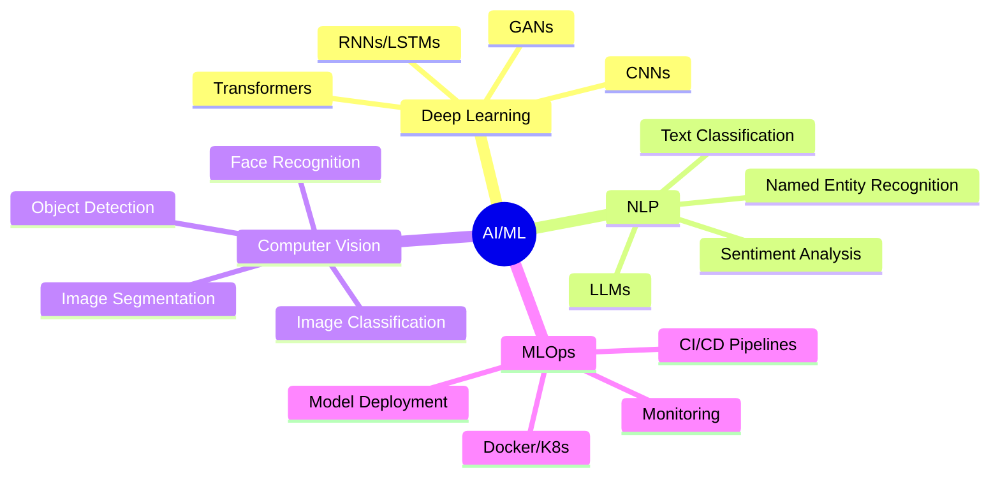

<!-- Header Animation -->
<div align="center">
  
</div>

<!-- Dynamic Typing -->
<p align="center">
  
</p>

---

## 🧬 **About Me**

```python
#!/usr/bin/env python3

class AIEngineer:
    def __init__(self):
        self.name = "Souvik Biswas"
        self.role = "AI/ML Engineer"
        self.location = "India 🇮🇳"
        self.code = ["Python", "TensorFlow", "PyTorch", "scikit-learn"]
        self.focus = {
            "learning": ["Deep Learning", "NLP", "Computer Vision"],
            "exploring": ["Generative AI", "LLMs", "Neural Architecture"],
            "building": ["Intelligent Systems", "ML Pipelines"]
        }
        
    def current_mission(self):
        return "Transforming ideas into intelligent solutions"
    
    def say_hello(self):
        print("👋 Hey there! Let's innovate together with AI!")

# Initialize
souvik = AIEngineer()
print(souvik.current_mission())
souvik.say_hello()
```

<div align="center">
  
**🔬 Passionate about pushing the boundaries of artificial intelligence**  
**🌱 Constantly learning and experimenting with cutting-edge ML technologies**  
**💡 Open to collaborating on innovative AI projects and research**

</div>

---

## 🛠️ **Tech Arsenal**

<div align="center">

### **AI/ML Frameworks**
<p>
  
</p>

### **Data Science & Analytics**
<p>
  
  
  
  
</p>

### **Computer Vision & NLP**
<p>
  
  
  
  
</p>

### **Development Tools**
<p>
  
</p>

### **Cloud & Databases**
<p>
  
  
  
  
</p>

</div>

---

## 🎯 **Current Focus Areas**

<div align="center">



</div>

---

## 📖 **What I'm Learning Right Now**

<div align="center">

| 🧠 **Deep Learning** | 🗣️ **NLP** | 👁️ **Computer Vision** | ⚙️ **MLOps** |
|:---:|:---:|:---:|:---:|
| Neural Networks | Transformers | CNNs | Model Serving |
| Optimization | BERT/GPT | Object Detection | Docker |
| Regularization | Fine-tuning | Image Segmentation | Kubernetes |
| Transfer Learning | Prompt Engineering | GANs | CI/CD |

</div>

---

## 🚀 **Recent Experiments**

<table align="center">
  <tr>
    <td align="center" width="50%">
      
      <h3>🧠 Neural Networks</h3>
      <p><em>Building & training custom architectures for various ML tasks</em></p>
    </td>
    <td align="center" width="50%">
      
      <h3>💬 NLP Models</h3>
      <p><em>Experimenting with transformers and language models</em></p>
    </td>
  </tr>
  <tr>
    <td align="center" width="50%">
      
      <h3>👁️ Computer Vision</h3>
      <p><em>Developing image classification and detection systems</em></p>
    </td>
    <td align="center" width="50%">
      
      <h3>📊 Data Analysis</h3>
      <p><em>Extracting insights from complex datasets</em></p>
    </td>
  </tr>
</table>

---

## 💻 **Code in Action**

```python
# A glimpse into my daily workflow

import tensorflow as tf
import pandas as pd
import numpy as np

# Loading and preprocessing data
def prepare_data(data_path):
    df = pd.read_csv(data_path)
    # Feature engineering magic ✨
    return processed_data

# Building neural networks
def create_model(input_shape):
    model = tf.keras.Sequential([
        tf.keras.layers.Dense(128, activation='relu'),
        tf.keras.layers.Dropout(0.3),
        tf.keras.layers.Dense(64, activation='relu'),
        tf.keras.layers.Dense(10, activation='softmax')
    ])
    return model

# Training with passion 🔥
model.compile(optimizer='adam', loss='categorical_crossentropy', metrics=['accuracy'])
history = model.fit(X_train, y_train, epochs=50, validation_data=(X_val, y_val))

print("🎯 Model trained successfully! Accuracy: {:.2f}%".format(accuracy * 100))
```

---

## 🌐 **Connect With Me**

<div align="center">

[](https://www.linkedin.com/in/souvik-biswas-b637a7379/)
[](mailto:your.email@example.com)
[](https://your-portfolio.com)
[](https://github.com/yourusername)

<br>

**💬 Open to discussing AI/ML, collaborating on projects, or just chatting about technology!**

</div>

---

## 🎓 **Learning Philosophy**

<div align="center">

> *"The best way to predict the future is to invent it."*  
> **– Alan Kay**

<br>

```ascii
  ╔══════════════════════════════════════╗
  ║  🧠 Learn → 💻 Build → 🚀 Deploy   ║
  ║                                      ║
  ║  Every model trained is a lesson     ║
  ║  Every bug fixed is growth           ║
  ║  Every project completed is progress ║
  ╚══════════════════════════════════════╝
```

</div>

---

## 🔥 **Fun Facts**

- 🤖 I think in tensors and matrices
- 📚 Always reading the latest AI research papers
- ☕ Fueled by coffee and curiosity
- 🎯 Believer in AI for good
- 🌟 Excited about the future of AGI

---

<div align="center">

### ⚡ **"Making machines smarter, one algorithm at a time"** ⚡

<br>


<br>


**✨ Thanks for stopping by! Let's build the future together ✨**

</div>
