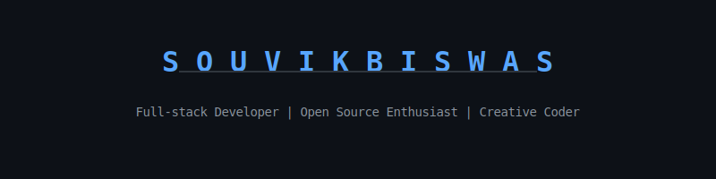

# 

  
  
  

---

### 💻 Profile Stats

  
  

  

---

### 🚀 Getting in Touch

- 💼 **LinkedIn:** [linkedin.com/in/souvikbiswas](https://linkedin.com/in/souvikbiswas)
- 🐦 **Twitter:** [@souvikbiswas](https://twitter.com/souvikbiswas)
- 🌐 **Portfolio:** [souvikbiswas.com](https://souvikbiswas.com)

---

### 🔭 Projects and Interests

- 🏢 Working on developing robust AI-driven agents.
- 🌱 Currently learning more about advanced system design and developer productivity tools.
- ⚡ Fun fact: I love to solve complex coding problems and build things from scratch!

---

  *Reflecting a passion for code and innovation. Inspired by the [Jakub T. Jankiewicz](https://github.com/jcubic) profile style.*

