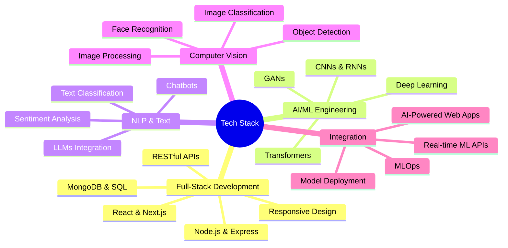

<!-- Header Animation -->
<div align="center">
  
</div>

<!-- Dynamic Typing -->
<p align="center">
  
</p>

---

## 🧬 **About Me**

<div align="center">

### 👨‍💻 Full-Stack Developer × 🤖 AI/ML Engineer

Hey there! I'm **Souvik Biswas**, a passionate developer who bridges the gap between **intelligent systems** and **beautiful user experiences**.

<br>

🌐 **Full-Stack Development** — Building scalable web applications with modern technologies  
🧠 **AI/ML Engineering** — Creating intelligent solutions with Deep Learning & NLP  
🚀 **Innovation Driven** — Combining web development with artificial intelligence

<br>

</div>

### 🎯 **What I Do**

- 💻 **Full-Stack Development**: Crafting robust web applications using React, Node.js, and modern frameworks
- 🤖 **AI/ML Engineering**: Building and deploying machine learning models for real-world applications
- 🔗 **AI Integration**: Bridging the gap by integrating AI capabilities into web applications
- 📊 **Data-Driven Solutions**: Leveraging data science to create intelligent, user-centric products
- 🌱 **Continuous Learning**: Exploring Deep Learning, NLP, Computer Vision, and cutting-edge ML technologies

<div align="center">

**🔬 Passionate about using AI to solve real-world problems**  
**💡 Open to collaborating on innovative web & AI projects**  
**🚀 Always experimenting with new technologies and frameworks**

</div>

---

## 🛠️ **Tech Arsenal**

<div align="center">

### **Frontend Development**
<p>
  
</p>

### **Backend Development**
<p>
  
</p>

### **AI/ML Frameworks**
<p>
  
</p>

### **Data Science & Analytics**
<p>
  
  
  
  
</p>

### **Computer Vision & NLP**
<p>
  
  
  
  
</p>

### **Development Tools & Cloud**
<p>
  
</p>

</div>

---

## 🎯 **Current Focus Areas**

<div align="center">



</div>

---

## 📖 **What I'm Learning Right Now**

<div align="center">

| 🌐 **Full-Stack** | 🧠 **Deep Learning** | 🗣️ **NLP** | 👁️ **Computer Vision** |
|:---:|:---:|:---:|:---:|
| Next.js 14 | Neural Networks | Transformers | CNNs |
| TypeScript | Optimization | BERT/GPT | Object Detection |
| GraphQL | Regularization | Fine-tuning | Image Segmentation |
| Microservices | Transfer Learning | Prompt Engineering | GANs |

</div>

---

## 🚀 **Recent Experiments**

<table align="center">
  <tr>
    <td align="center" width="50%">
      
      <h3>🌐 Full-Stack Apps</h3>
      <p><em>Building modern web applications with React, Node.js & databases</em></p>
    </td>
    <td align="center" width="50%">
      
      <h3>🧠 Neural Networks</h3>
      <p><em>Training custom architectures for various ML tasks</em></p>
    </td>
  </tr>
  <tr>
    <td align="center" width="50%">
      
      <h3>💬 AI Integration</h3>
      <p><em>Integrating ML models into web applications</em></p>
    </td>
    <td align="center" width="50%">
      
      <h3>👁️ Computer Vision</h3>
      <p><em>Developing image classification and detection systems</em></p>
    </td>
  </tr>
</table>

---

## 💻 **Code in Action**

<table>
<tr>
<td width="50%">

**Full-Stack Development**
```javascript
// Building modern web apps
const express = require('express');
const app = express();

app.get('/api/data', async (req, res) => {
  const data = await fetchFromDB();
  res.json({ success: true, data });
});

// React Component
const Dashboard = () => {
  const [data, setData] = useState([]);
  
  useEffect(() => {
    fetchData().then(setData);
  }, []);
  
  return <DataVisualizer data={data} />;
};
```

</td>
<td width="50%">

**AI/ML Engineering**
```python
# Training ML models
import tensorflow as tf
import numpy as np

# Build neural network
model = tf.keras.Sequential([
    tf.keras.layers.Dense(128, activation='relu'),
    tf.keras.layers.Dropout(0.3),
    tf.keras.layers.Dense(64, activation='relu'),
    tf.keras.layers.Dense(10, activation='softmax')
])

# Train model
model.compile(optimizer='adam', 
              loss='categorical_crossentropy',
              metrics=['accuracy'])

history = model.fit(X_train, y_train, 
                   epochs=50, 
                   validation_data=(X_val, y_val))
```

</td>
</tr>
</table>

---

## 🌐 **Connect With Me**

<div align="center">

[](https://www.linkedin.com/in/souvik-biswas-b637a7379/)
[](mailto:your.email@example.com)
[](https://your-portfolio.com)
[](https://github.com/yourusername)

<br>

**💬 Open to discussing AI/ML, collaborating on projects, or just chatting about technology!**

</div>

---

## 🎓 **Learning Philosophy**

<div align="center">

> *"The best way to predict the future is to invent it."*  
> **– Alan Kay**

<br>

```ascii
  ╔══════════════════════════════════════╗
  ║  🧠 Learn → 💻 Build → 🚀 Deploy   ║
  ║                                      ║
  ║  Every model trained is a lesson     ║
  ║  Every bug fixed is growth           ║
  ║  Every project completed is progress ║
  ╚══════════════════════════════════════╝
```

</div>

---

## 🔥 **Fun Facts**

- 💻 I build web apps by day and train neural networks by night
- 🤖 Passionate about integrating AI into everyday applications
- 📚 Always exploring new frameworks and ML research papers
- ☕ Fueled by coffee and curiosity
- 🎯 Believer in using technology to create meaningful impact
- 🌟 Excited about the intersection of web development and AI

---

<div align="center">

### ⚡ **"Building intelligent web experiences, one line of code at a time"** ⚡

<br>


<br>


**✨ Thanks for stopping by! Let's build the future together ✨**

</div>
